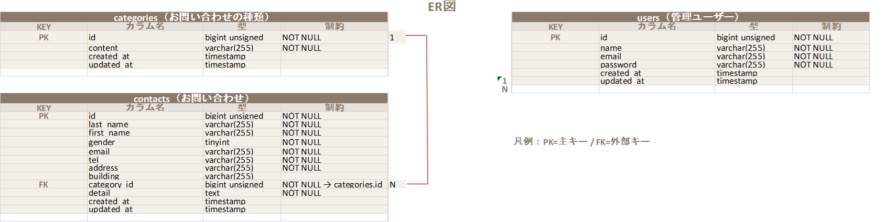

# FashionablyLate(お問い合わせ管理アプリ)

お問い合わせフォームから送信された内容を管理者が確認・検索・削除できる
Laravel製のWebアプリケーションです。

## 環境構築
### Dockerビルド

-git clone git@github.com:nozonosuke/check.git

-docker-compose up -d --build

### Laravel環境構築
-docker-compose exec php bash

-php artisan key:generate

-php artisan migrate

-php artisan db:seed

## 使用技術（実行環境）
-Laravel 8.x（8.83.29）

-PHP 8.2

-MySQL 8.0.26

-Nginx 1.21.1

-Docker / Docker Compose

-Git / GitHub

## ER図

    

## 機能一覧
-お問い合わせフォーム入力

-お問い合わせ内容確認

-お問い合わせ送信完了（サンクスページ）

-管理者ログイン / ログアウト

-お問い合わせ一覧表示

-検索機能（名前・メール・性別・カテゴリ・日付）

-ページネーション

-お問い合わせ詳細モーダル表示

-お問い合わせ削除

## URL
### 開発環境
-お問い合わせフォーム入力ページ：http://localhost/

-お問い合わせフォーム確認ページ：http://localhost/confirm

-サンクスページ：http://localhost/thanks

-管理画面：http://localhost/admin

-検索：http://localhost/admin

-検索リセット：http://localhost/admin

-お問い合わせフォーム削除：http://localhost/admin

-ユーザ登録：http://localhost/register

-ログイン：http://localhost/login

-ログアウト：http://localhost/admin

